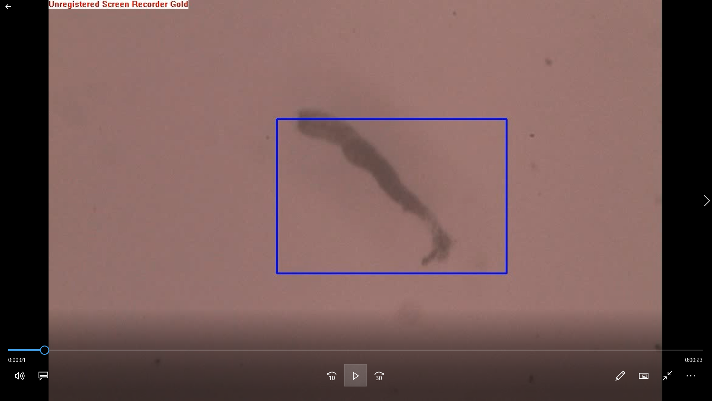

# **Amoeba Video Detection**

You can run the inference on amoeba video in `original-video` with Mask R-CNN trained model in Google Colab (). 

The trained model to detect amoeba is in the folder of `trained-amoeba-model` and you can directly use it. This is trained using the method in the submodule of [amoeba-detection](https://github.com/BaosenZ/amoeba-detection) with the dataset here `dataset-for-detect-video`. 

The folder of `output-video` contains some output detected videos. 

The `webcam-detection` can only work on your local computer and you need to setup environment by yourself. 

 

## Amoeba Videos
Watch detected amoeba video: 

